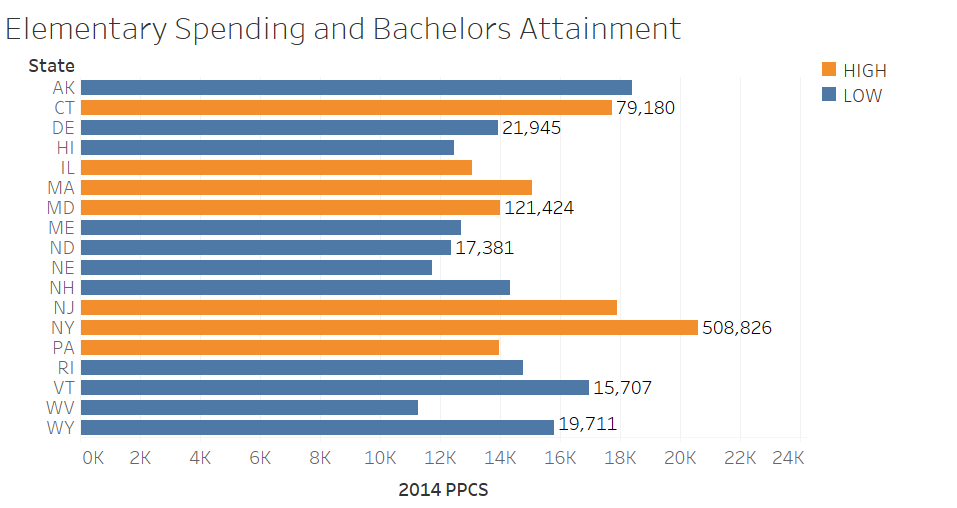
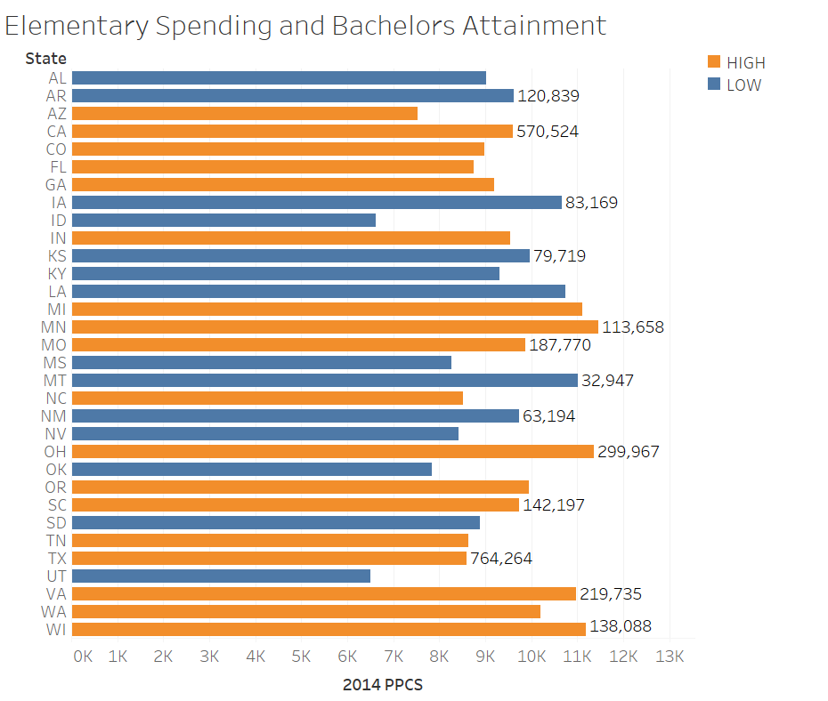
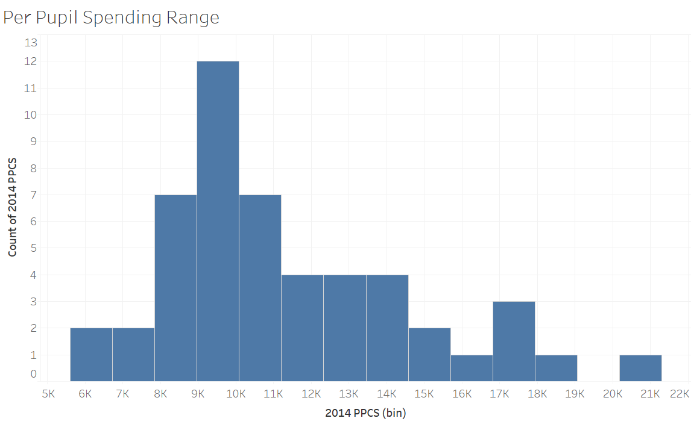
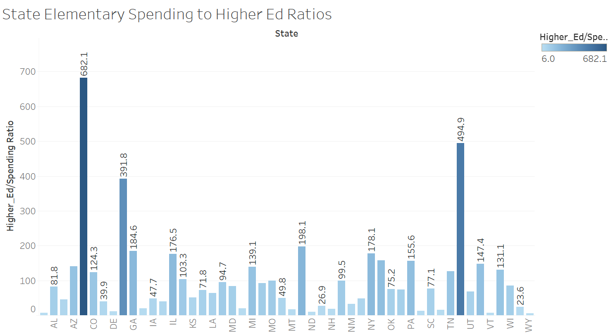
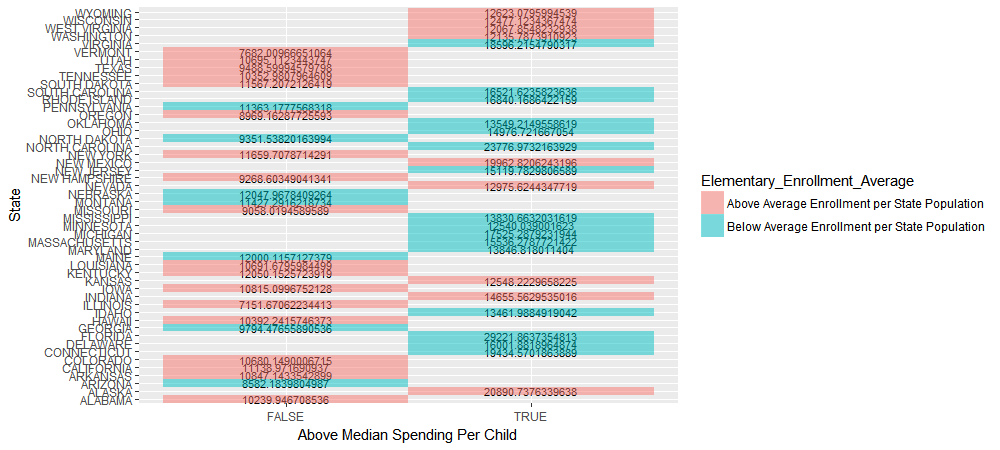
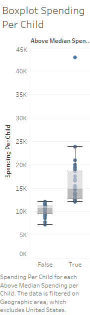
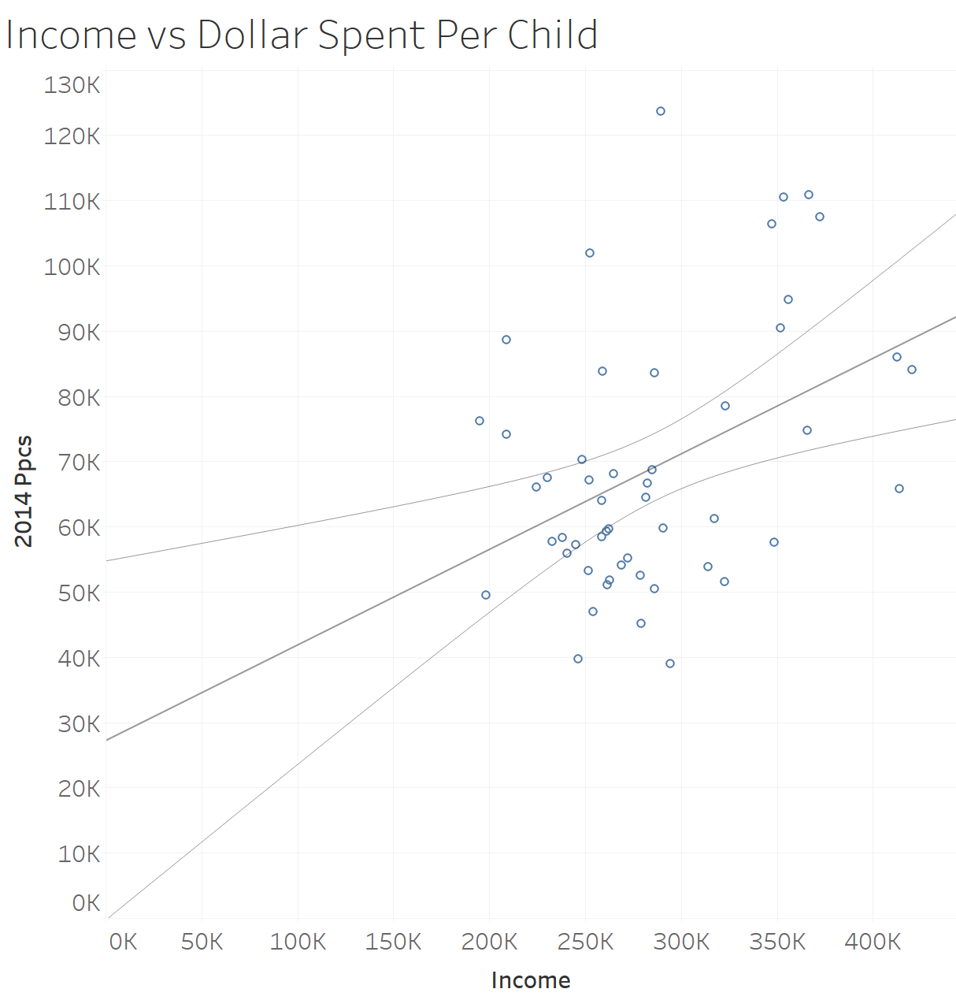

<center></center>

#**Introduction**
The dataset we found allows us to distill and analyze key economic indicators from the United States during the years 2005 through 2016. A few of our findings are demonstrated below.

#**R Configuration**
Below we display our sessionInfo() and the packages we've required.

```{r sessionInfo}
sessionInfo(package=NULL)
require("jsonlite")
require("RCurl")
require("ggplot2")
require("dplyr")
```

#**The Data**
*Disclaimer: The visualizations in this section were created using Tableau 10. The R code that is featured will recreate the visuals that were rendered in Tableau.*


```{r }
source('connect_to_rest_server.R')

```

#*ETL Script*
In the file sourced below, we ran all of our data through an ETL to clean it up and make sure there weren't any issues with the dataframes we would eventually use in our example. 

```{r eval=FALSE}
require(dplyr)
require(data.world)
#-----------------------FILE ONE------------------------------------------

df1 <- query(
  data.world(propsfile = "www/.data.world"),
  dataset="chriscrider/s-17-edv-project-3", type="sql",
  query = "SELECT * FROM ElementarySpending join `acs-2015-5-e-education-QueryResult` 
  on (ElementarySpending.State = `acs-2015-5-e-education-QueryResult`.AreaName)"
) 


df <- df1
names(df)
str(df) # Uncomment this line and  run just the lines to here to get column types to use for getting the list of measures.


dimensions <- c("State", "AreaName")

measures <-  setdiff(names(df), dimensions)


# Get rid of special characters in each column.
# Google ASCII Table to understand the following:
for(n in names(df)) {
  df[n] <- data.frame(lapply(df[n], gsub, pattern="[^ -~]",replacement= ""))
}

str(df)
# The following is an example of dealing with special cases like making state abbreviations be all upper case.
# df["State"] <- data.frame(lapply(df["State"], toupper))

# The following is an example of dealing with special cases like making state abbreviations be all upper case.
# df["State"] <- data.frame(lapply(df["State"], toupper))

na2emptyString <- function (x) {
  x[is.na(x)] <- ""
  return(x)
}
if( length(dimensions) > 0) {
  for(d in dimensions) {
    # Change NA to the empty string.
    df[d] <- data.frame(lapply(df[d], na2emptyString))
    # Get rid of " and ' in dimensions.
    df[d] <- data.frame(lapply(df[d], gsub, pattern="[\"']",replacement= ""))
    # Change & to and in dimensions.
    df[d] <- data.frame(lapply(df[d], gsub, pattern="&",replacement= " and "))
    # Change : to ; in dimensions.
    df[d] <- data.frame(lapply(df[d], gsub, pattern=":",replacement= ";"))
  }
}

na2zero <- function (x) {
  x[is.na(x)] <- 0
  return(x)
}
# Get rid of all characters in measures except for numbers, the - sign, and period.dimensions, and change NA to 0.
if( length(measures) > 1) {
  for(m in measures) {
    print(m)
    df[m] <- data.frame(lapply(df[m], gsub, pattern="[^--.0-9]",replacement= ""))
    df[m] <- data.frame(lapply(df[m], na2zero))
    df[m] <- lapply(df[m], function(x) as.numeric(as.character(x)))
 # This is needed to turn measures back to numeric because gsub turns them into strings.
  }
}

education <- df

str(education)


#-----------------------FILE TWO----------------------------------------


df2 <- query(
  data.world(propsfile ="www/.data.world"),
  dataset="chriscrider/s-17-dv-project-5/", type="sql",
  query = "SELECT * FROM `SchoolSpending.csv/SchoolSpending` as elementaryspending join `PopulationandElementaryEnrollment` as population on(`SchoolSpending`.State = `PopulationandElementaryEnrollment` .State)")


df <- df2
names(df)
str(df) # Uncomment this line and  run just the lines to here to get column types to use for getting the list of measures.


dimensions <- c("State", "State_1")

measures <-  setdiff(names(df), dimensions)


# Get rid of special characters in each column.
# Google ASCII Table to understand the following:
for(n in names(df)) {
  df[n] <- data.frame(lapply(df[n], gsub, pattern="[^ -~]",replacement= ""))
}

str(df)
# The following is an example of dealing with special cases like making state abbreviations be all upper case.
# df["State"] <- data.frame(lapply(df["State"], toupper))

# The following is an example of dealing with special cases like making state abbreviations be all upper case.
# df["State"] <- data.frame(lapply(df["State"], toupper))

na2emptyString <- function (x) {
  x[is.na(x)] <- ""
  return(x)
}
if( length(dimensions) > 0) {
  for(d in dimensions) {
    # Change NA to the empty string.
    df[d] <- data.frame(lapply(df[d], na2emptyString))
    # Get rid of " and ' in dimensions.
    df[d] <- data.frame(lapply(df[d], gsub, pattern="[\"']",replacement= ""))
    # Change & to and in dimensions.
    df[d] <- data.frame(lapply(df[d], gsub, pattern="&",replacement= " and "))
    # Change : to ; in dimensions.
    df[d] <- data.frame(lapply(df[d], gsub, pattern=":",replacement= ";"))
  }
}

na2zero <- function (x) {
  x[is.na(x)] <- 0
  return(x)
}
# Get rid of all characters in measures except for numbers, the - sign, and period.dimensions, and change NA to 0.
if( length(measures) > 1) {
  for(m in measures) {
    print(m)
    df[m] <- data.frame(lapply(df[m], gsub, pattern="[^--.0-9]",replacement= ""))
    df[m] <- data.frame(lapply(df[m], na2zero))
    df[m] <- lapply(df[m], function(x) as.numeric(as.character(x)))
    # This is needed to turn measures back to numeric because gsub turns them into strings.
  }
}

elementaryspending <- df

str(elementaryspending)
#-----------------------FILE THREE----------------------------------------


dataframee <- query(
  data.world(propsfile = "www/.data.world"),
  dataset="chriscrider/s-17-edv-project-3", type="sql",
  query = "SELECT *
  FROM Pupil_Per_Spending join USA_All_States_Income on (Pupil_Per_Spending.`Abbreviation:`=USA_All_States_Income.State)"
  
) 


df <- dataframee
names(df)
str(df) # Uncomment this line and  run just the lines to here to get column types to use for getting the list of measures.

dimensions <- c("Geographic area", "State", "Abbreviation:", "Race")

measures <- setdiff(names(df), dimensions)


# Get rid of special characters in each column.
# Google ASCII Table to understand the following:
for(n in names(df)) {
  df[n] <- data.frame(lapply(df[n], gsub, pattern="[^ -~]",replacement= ""))
}

str(df)
# The following is an example of dealing with special cases like making state abbreviations be all upper case.
# df["State"] <- data.frame(lapply(df["State"], toupper))

# The following is an example of dealing with special cases like making state abbreviations be all upper case.
# df["State"] <- data.frame(lapply(df["State"], toupper))

na2emptyString <- function (x) {
  x[is.na(x)] <- ""
  return(x)
}
if( length(dimensions) > 0) {
  for(d in dimensions) {
    # Change NA to the empty string.
    df[d] <- data.frame(lapply(df[d], na2emptyString))
    # Get rid of " and ' in dimensions.
    df[d] <- data.frame(lapply(df[d], gsub, pattern="[\"']",replacement= ""))
    # Change & to and in dimensions.
    df[d] <- data.frame(lapply(df[d], gsub, pattern="&",replacement= " and "))
    # Change : to ; in dimensions.
    df[d] <- data.frame(lapply(df[d], gsub, pattern=":",replacement= ";"))
  }
}

na2zero <- function (x) {
  x[is.na(x)] <- 0
  return(x)
}
# Get rid of all characters in measures except for numbers, the - sign, and period.dimensions, and change NA to 0.
if( length(measures) > 1) {
  for(m in measures) {
    print(m)
    df[m] <- data.frame(lapply(df[m], gsub, pattern="[^--.0-9]",replacement= ""))
    df[m] <- data.frame(lapply(df[m], na2zero))
    df[m] <- lapply(df[m], function(x) as.numeric(as.character(x)))
    # This is needed to turn measures back to numeric because gsub turns them into strings.
  }
}

incomestuff <- df


```
```{r }
source('R_ETL.R')
```

We pulled our data from data.world using the ETL file and stored them as variables that we will use in our examples. The data involves 2015 Census data on race, income and education breakdown by state and data on how states spend money on education. We will explain further as we go through our examples below. 

#**Shiny Examples** 


These following bar graphs show per pupil spending by state and are separated and colored by whether or not they have a relatively high rate of bachelor degree attainment amon their residents. The aim of this visualization is to point out a possible correlation or lack thereof between elementary investment by the state and continuing education of its residents.
```{r eval=FALSE}
    ggplot(highbardf, aes(x=State, y=X2014.PPCS, fill=bach_abv_avg))+ 

      geom_bar(stat='identity') +
      ylab('Per Child Spending') +
      coord_flip() +
      ggtitle('Bachcelors Performance - High Spending States') +
      geom_text(aes(label=Bachelors))

    ggplot(lowbardf, aes(x=State, y=X2014.PPCS, fill=bach_abv_avg)) + 
      geom_bar(stat='identity') +
      ylab('Per Child Spending') +
      coord_flip() +
      ggtitle('Bachelors Performance - Low Spending States') + 
      geom_text(aes(label=Bachelors))
```

<center></center>
<br/>
<center></center>

To recreate this Visualization, Drag 2014 PPCS onto Columns, State on to rows, and select a Bar graph.
To color and filter, create a calculated field on 2014 PPCS named "PPCS to Avg" with the following code:
```{}
IF SUM([2014 PPCS]) > WINDOW_AVG(SUM([2014 PPCS]))
    THEN 'HIGH'
ELSE 'LOW'

END
```
and drag it to filters, then create a calculated field on Bachelors titled "Relative_Bachelors" using the following code:
```{}
IF [Bachelors] > 500000  * WATCH OUT FOR A TABLEAU ERROR IN WHICH BACHELORS IS MISSPELLED/MISLABELED - ADJUST ACCORDINGLY
    THEN 'HIGH'

ELSE 'LOW'

END
```
and drag it to color. Finally, drag Bachelors to Label.


This following graph is a simple histograme representing the distribution of per pupil elementary school spending by state. Notice that the histogram is most dense around 8-10k per pupil.

```{r eval=FALSE}
       ggplot(df1) + geom_histogram(aes(x = `X2014.PPCS`, fill = I('dodgerblue4'), col=I('red'))) + 
      xlab('Per Child Spending') + 
      ylab('Bin of States') +
      ggtitle('Per Pupil Spending Range')
```

<center></center>

To recreate this visualization in Tableau, simply click on Bachelors and choose Histogram view under 'show me'

This next bar graph displays the states along with their ratios of per pupil spending to bachelors attainment. While seemingly a curious choice for a ratio, it is effective in displaying what if any correlation there may be between state elementary spending and higher education attainment. The kpi used helps give a general notion of which states invest most heavily in elementary education and where it seems to pay off or not.

```{r eval=FALSE}
    ggplot(df1, aes(x=State,  y=kpi_bach_ratio, fill = kpi_bach_ratio)) + 
      geom_bar(stat='identity') + 
      theme(axis.text.x=element_text(angle=90, size=10, vjust=0.5))+
      ylab('Bachelor Attainment to Spending Ratio') + 
      ggtitle('KPI Bachelor Ratio Performance by State')
```

<center></center>

To recreate this graph in tableau:
Create a calculated field on Bachelors named 'Higher_ed/Spending Ratio' using the following code:
```{}
[Higher_ED] / [2014 PPCS]
```
and drag it to rows. Drag State to Columns. Drag 'Higher_Ed/Spending Ratio' to color.

The following graph is a cross tabulation. Notice how most states above average median spending have a below average enrollment per population. These states spend more on their child and have less children in each state. Some interesting things to point out would be that big states such as California and Texas have a huge population and spends less on each children. In addition, another interesting thing would be how the state of utah is way below the median spending per child and it is above in terms of child enrollment over population. Furthermore, most of the northeastern states have an above median spending per child as compared to the southern states.
```{r eval=FALSE}
ggplot(df) + geom_text(aes(x = Above_Median_SPC, y=State, label=Spending_Per_Child),size=3)+xlab("Above Median Spending Per Child")+geom_tile(aes(x=Above_Median_SPC, y=State,fill=Elementary_Enrollment_Average), alpha=0.50)
```

<center></center>

The crosstab can be recreated in tableau by putting geographical area in the rows section and above median spending in the columns section. To the above median spending, find the median value for the states and create a calculated field that will give the true/false value if the number is above or beneath the median spending. Then, add the text Sum(Spending per child) in the text section underneath marks. Color the crosstab with Above Average Enrollment per state population by using a calculated field to determine the average enrollment per state population and then using another calculated field to determine the true/false value of each enrollment/population.

The following boxplot shows that the states that are below the median do not deviate too much from one another. However, the states that spend above the median have huge ranges. For instance, one of the biggest outliers is the district of columnbia which could be due to the small population of children vs. the amount of money in the region. 

```{r eval=FALSE}
df5 = data.frame(elementaryspending)
df5$Spending_Per_Child <- (df5$Total.Spending..in.thousands.*1000/df5$Elementary.secondary.enrollment)

df5$Above_Median_SPC <- df5$Spending_Per_Child > median(df5$Spending_Per_Child)

df5$Elementary_Enrollment_Average <- ifelse (df5$Elementary.secondary.enrollment/df5$State.population..in.thousands.<=mean(df5$Elementary.secondary.enrollment/df5$State.population..in.thousands.),"Below Average Enrollment per State Population","Above Average Enrollment per State Population")

box_plot <- ggplot() +geom_boxplot(aes(x= df5$Above_Median_SPC,y = df5$Spending_Per_Child)) + xlab("Above Median Spending Per Child") + ylab("Spending Per Child")
print(box_plot)

```
<center></center>

To recreate in Tableau, first uncheck aggregate measures and drag the spending per child onto the rows section. Next, determine the median spending per child and create a calculated field that outputs a true/false value to determine the above median spending per child. Drag the above median spending per child to the columns section and on the show me click on the box pot diagram.

This final plot is a scatter plot that shows what could be a potential correlation between how much--on average--an individual in a state makes and how much that state invests in education per child. After further analysis though (r=.17), we can infer that there is no direct correlation between the two measures. 

```{r eval=FALSE}
ggplot(incomestuff, aes(x=Income, y=`2014 PPCS`)) + geom_point(shape=1) + geom_smooth(method=lm)+ scale_x_continuous(name="Income", label=dollar)+scale_y_continuous(name="2014 PPCS", label=dollar)
```

<center></center>

To recreate this in Tableau, you will need to drag Income to Columns and 2014 PPCS to Rows. You can also add State to the labels mark in order to see the dots clearer. To add the line of regression, click Analysis at the top, click on Trends and add a trend line. 

